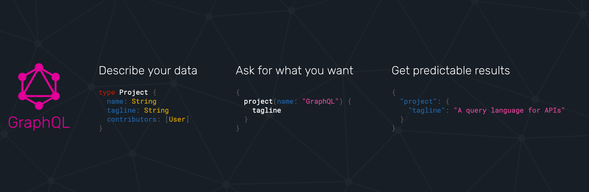

import { Horizontal } from "mdx-deck/layouts";
import Image from "mdx-deck";

import Title from "../components/Title.js";
import Layout from "../components/Layout.js";
import LayoutCentered from "../components/LayoutCentered.js";
import Split from "../components/Split.js";

export { default as theme } from "../theme.js";

<Title>

# GraphQL

## Programación Web II

</Title>

---

<Title>

## Antecedente: REST

</Title>

---

<Layout>

# REST

- Client-Server.
- Stateless Communication.
- Caching.
- Uniform Interface.
- Layered System.
- Code-on-demand (optionally).

</Layout>

---

<Layout>

# REST

- No es especificación.
- Numerosas peticiones.
- Representaciones inflexibles.

</Layout>

---

<Title>

## Qué es GraphQL

</Title>

---

<Layout borderless>



</Layout>

---

<Title>

## Query Language

## para API's

</Title>

---

<Title>


</Title>

---

<LayoutCentered>

# Tipado estático

```graphql
type Query {
  me: User
  user(id: ID): User
  team(id: ID): [User]
}

type User {
  id: ID
  name: String
}
```

</LayoutCentered>

---

<LayoutCentered>

# Framework agnostic, Language agnostic

<iframe width="100%" height="500px" src="https://graphql.org/code/" />

</LayoutCentered>

---

<LayoutCentered>

# Documentación, herramientas

<iframe
  width="100%"
  height="500px"
  src="https://graphql.github.io/swapi-graphql/"
/>

</LayoutCentered>

---

<Title>

## Ejemplos

</Title>

---

<Layout>

# Query

<Split stepped>

<section>

### Esquema:

```graphql
type Query {
  me: User
}

type User {
  id: ID
  name: String
}
```

</section>

<section>

### Petición:

```graphql
{
  me {
    name
  }
}
```

</section>

<section>

### Respuesta:

```json
{
  "user": {
    "name": "Luke"
  }
}
```

</section>

</Split>
</Layout>

---

<Layout>

# Parámetros

<Split>

<section>

### Esquema:

```graphql
type Query {
  me: User
  user(id: ID): User
}

type User {
  id: ID
  name: String
}
```

</section>

<section>

### Petición:

```graphql
{
  user(id: "1337") {
    name
  }
}
```

</section>

<section>

### Respuesta:

```json
{
  "user": {
    "name": "Luke"
  }
}
```

</section>

</Split>
</Layout>

---

<Layout>

# Nombre de operación

<Split>

<section>

### Esquema:

```graphql
type Query {
  me: User
  user(id: ID): User
}

type User {
  id: ID
  name: String
}
```

</section>

<section>

### Petición:

```graphql
query findUser {
  user(id: "1337") {
    name
  }
}
```

</section>

<section>

### Respuesta:

```json
{
  "user": {
    "name": "Luke"
  }
}
```

</section>

</Split>
</Layout>

---

<Layout>

# Mutation

<Split stepped>

<section>

### Esquema:

```graphql
type Mutation {
  createUser(name: String): User
}

type User {
  id: ID
  name: String
}
```

</section>

<section>

### Petición:

```graphql
mutation {
  createUser(name: "Luke") {
    name
  }
}
```

</section>

<section>

### Respuesta:

```json
{
  "user": {
    "name": "Luke"
  }
}
```

</section>

</Split>
</Layout>

---

<Title>

# 🙋🏻‍♀️ 🙋🏽‍♂️

</Title>

---

# Recursos adicionales

- [awesome-graphql](https://github.com/chentsulin/awesome-graphql).
- [GraphQL docs](https://graphql.org/learn/).
- [Librería Apollo](https://www.apollographql.com/).
- [Ejemplo demostrado en clase](https://glitch.com/edit/#!/2019-20-graphql?path=server.js).
